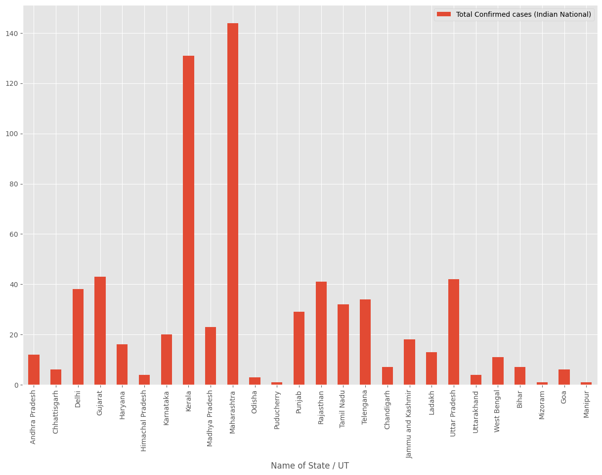
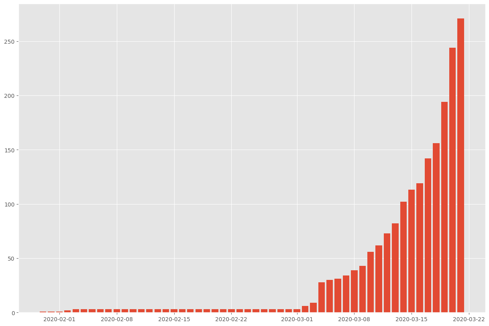
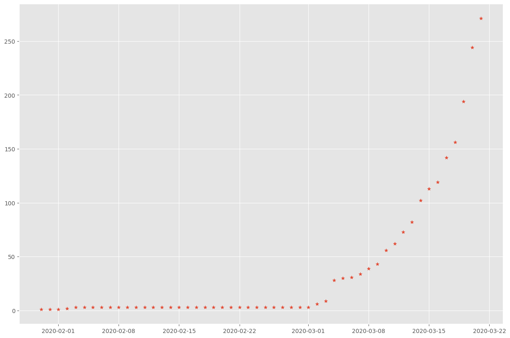
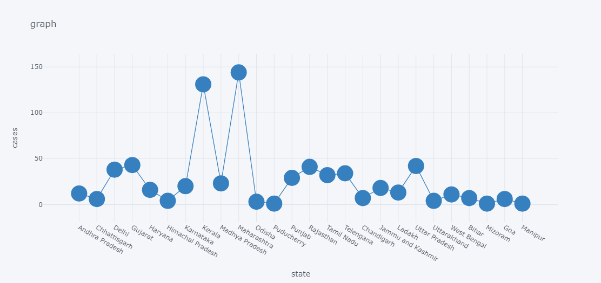

# COVID-19 Visualization Project

## Overview
This project aims to visualize COVID-19 cases in India using Python and various libraries such as Seaborn, Folium, and Matplotlib. The project includes plots of bar charts, maps, and graphs to represent the spread and distribution of COVID-19 cases across different states in India.

## Requirements
- Python 3.x
- Pandas
- NumPy
- Seaborn
- Folium
- Matplotlib

## Installation
1. Clone the repository:
2. Install the required dependencies:
   ## Usage
1. Ensure you have the required Python libraries installed.
2. Run the Jupyter notebook `covid_visualization.ipynb` to see the visualizations.
3. The notebook contains code snippets for plotting bar charts, maps, and other visualizations related to COVID-19 cases in India.

## Files
- `covid_visualization.ipynb`: Jupyter notebook containing the code for visualizing COVID-19 data.

## Example Figures

*Figure 1: Bar chart showing the total number of COVID-19 cases in different states of India.*

*Figure 2: Bar chart showing the total number of COVID-19 cases in the year 2020(India).*

*Figure 3: Scatter Plot displaying the distribution of COVID-19 cases in month of February and March 2020 in India.*

*Figure 4:Scatter plot displaying the distribution of COVID-19 cases in India.*

*Figure 5:Map displaying the red zones states in India(2020).*

*Figure 6:Scatter plot showing the total cases in the yeay 2020(India)
.png)

*Figure 7:Comparision of COVID Cases in different countries

## Contributors
- [Hemanth Kumar Reddy Tiyyagura](https://github.com/nanihemanth)

